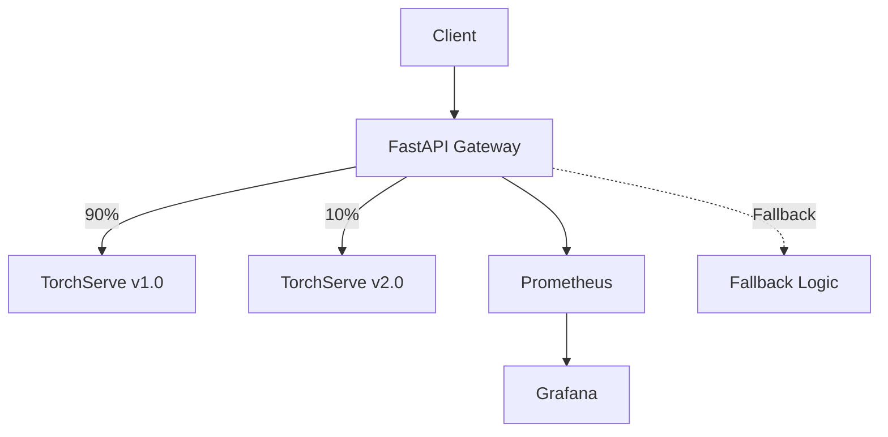

# 🛡️ Project Seraphim

[](LICENSE)
[](https://github.com/yourhandle/project-seraphim/actions)
[](https://www.python.org/)
[](https://kubernetes.io/)

---

**Project-Seraphim** is an **AI reliability engineering monorepo**.  
It demonstrates how to run ML/LLM inference with production-grade guardrails:

- ✅ **SLO enforcement** for latency, availability, and error rates  
- 🔄 **Canary & rollback workflows** for safe model releases  
- 📈 **Drift detection** using embeddings and prediction distributions  
- 🔧 **Auto-scaling** on GPU/CPU usage and request throughput  
- 🧪 **Failure injection** and chaos experiments to validate resilience  

---

## 🚀 Quick Start

### Using Docker Compose (Recommended for Local Dev)

```bash
# Clone repo
git clone https://github.com/yourhandle/project-seraphim.git
cd project-seraphim

# Start services with Docker Compose (gateway, TorchServe, Prometheus, Grafana)
docker compose up -d --build

# Verify core services
curl http://localhost:8088/healthz      # Gateway health
curl http://localhost:9081/models       # TorchServe models (mgmt API)

# Verify observability
curl http://localhost:8088/metrics | head -n 10   # Gateway metrics
curl -s 'http://localhost:9090/api/v1/targets' | jq '.data.activeTargets | map({job: .labels.job, health: .health})'

# Test inference (10% canary to v2.0, 90% to v1.0)
curl -X POST http://localhost:8088/predict \
  -H "Content-Type: application/json" \
  -d '{"text": "hello world"}'

# Force specific model version
curl -X POST http://localhost:8088/predict \
  -H "Content-Type: application/json" \
  -H "X-Canary: candidate" \
  -d '{"text": "test canary"}'

# Generate some traffic so Prometheus/Grafana have data
for i in {1..50}; do \
  curl -s -X POST http://localhost:8088/predict -H 'Content-Type: application/json' -d "{\"text\": \"load$i\"}" >/dev/null; \
done
```

#### Local endpoints and ports

- Gateway (FastAPI)
  - http://localhost:8088/healthz, /readyz, /metrics, /predict
- TorchServe
  - Inference: http://localhost:9080
  - Management: http://localhost:9081
  - Metrics: http://localhost:9082/metrics
- Prometheus: http://localhost:9090
- Grafana: http://localhost:3000 (default admin/admin)

Open Grafana and select the "Seraphim Inference Overview" dashboard (auto-provisioned).

See the [Observability Guide](docs/observability.md) for monitoring details and the [Operations Guide](docs/operations.md) for deployment, troubleshooting, and maintenance procedures.

### Using Kubernetes

```bash
# Bootstrap cluster + observability stack
make infra-apply

# Deploy inference service + monitoring
make deploy

# Run load test + watch dashboards  
make load-test

👉 View Grafana dashboards at http://localhost:3000 and track SLOs in real time.
```

---

## 🏗️ Architecture



### Components

- **FastAPI Gateway** (`services/inference/`): Handles routing, canary logic, and fallback
- **TorchServe** (`services/model-server/`): Serves ML models with versioning support
- **Observability** (`config/observe/`): Prometheus metrics and Grafana dashboards
- **Reliability** (`config/reliability/`): Canary evaluation, chaos testing, drift detection

## 🔧 Configuration

### Environment Variables (Gateway)

| Variable | Description | Default |
|----------|-------------|---------|  
| `TS_URL` | TorchServe URL for baseline | `http://localhost:8080` |
| `TS_URL_CANDIDATE` | TorchServe URL for candidate | Same as `TS_URL` |
| `MODEL_NAME_BASELINE` | Baseline model name | `custom-text` |
| `MODEL_VERSION_BASELINE` | Baseline version | `1.0` |
| `MODEL_NAME_CANDIDATE` | Candidate model name | `custom-text` |
| `MODEL_VERSION_CANDIDATE` | Candidate version | `2.0` |
| `CANARY_PERCENT` | % traffic to candidate (0-100) | `10` |
| `CANARY_STICKY_HEADER` | Header for sticky routing | `X-User-Id` |
| `TS_TIMEOUT_MS` | Timeout for TorchServe calls | `3000` |

### Canary Routing

The gateway supports three routing modes:

1. **Random**: Default behavior, routes based on `CANARY_PERCENT`
2. **Sticky**: Uses hash of `X-User-Id` header for consistent routing
3. **Force**: Override with `X-Canary: candidate` or `X-Canary: baseline`

## 🧪 Testing

```bash
# Run unit tests
pytest tests/unit/

# Run canary routing tests
pytest tests/unit/test_canary_routing.py -v

# Run load tests
locust -f tests/e2e/locustfile.py --host http://localhost:8088
```

### Linting & Formatting

Use black, isort, and flake8 (configured via `setup.cfg`, line length 88):

```bash
# Format
black services/ tests/ config/

# Sort imports
isort services/ tests/ config/

# Lint
flake8 services/ tests/ config/
```

## 📊 Monitoring

- Metrics endpoints
  - Gateway: exposes Prometheus metrics at `/metrics` (includes request counters, latency histogram, per-variant labels)
  - TorchServe: exports metrics on 9082/metrics (Prometheus format enabled)
- Prometheus
  - Config at `config/observe/prometheus/prometheus.yml`
  - Scrapes: gateway (inference:8080), TorchServe (model-server:8082)
  - Example queries used by the dashboard:
    - RPS (1m): `sum(rate(seraphim_inference_requests_total[1m]))`
    - Error % (5m): `(sum(rate(seraphim_inference_requests_total{outcome!="success"}[5m])) / sum(rate(seraphim_inference_requests_total[5m]))) * 100`
    - p95 latency (ms): `histogram_quantile(0.95, sum by (le) (rate(seraphim_inference_latency_seconds_bucket[5m]))) * 1000`
- Grafana
  - Provisioned datasource pointing to Prometheus
  - Dashboard JSON at `config/observe/grafana/dashboards/seraphim.json`
  - Panels include: RPS, Error %, p95 latency, Requests by Variant, Requests by Outcome, (optional) TorchServe RPS
  - Login: admin/admin (local compose default)

Tip: If TorchServe metrics appear empty on some images, rely on gateway metrics. You can still view TorchServe job health in Prometheus targets.

## 🚢 Deployment

### Docker (Apple Silicon / M1)

The TorchServe image uses `linux/amd64` platform to ensure compatibility:

```yaml
services:
  model-server:
    platform: linux/amd64
    build:
      platforms:
        - linux/amd64
```

### Kubernetes

```bash
# Deploy to specific environment
helm upgrade --install seraphim-inference \
  config/infra/helm/seraphim-inference \
  -f config/infra/helm/seraphim-inference/values-${ENV}.yaml
```

---

## 📖 About the Name

Derived from Seraphim — guardians and watchers - this project acts as a guardian for AI systems, ensuring reliability, trust, and resilience in production ML.
