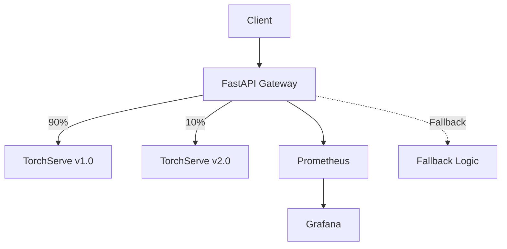

# Welcome to Project Seraphim! 🛡️

Welcome to the documentation site for **Project Seraphim**, an AI reliability engineering platform that demonstrates how to run ML/LLM inference with production-grade guardrails.

## What is Project Seraphim?

Project Seraphim is a comprehensive platform that showcases:

- ✅ **SLO enforcement** for latency, availability, and error rates  
- 🔄 **Canary & rollback workflows** for safe model releases  
- 📈 **Drift detection** using embeddings and prediction distributions  
- 🔧 **Auto-scaling** on GPU/CPU usage and request throughput  
- 🧪 **Failure injection** and chaos experiments to validate resilience  

## Quick Start

Get up and running in minutes:

```bash
# Clone the repository
git clone https://github.com/j0c2/project-seraphim.git
cd project-seraphim

# Start all services
docker-compose up -d

# Verify the platform is running
curl http://localhost:8000/health
```

## Architecture Overview



The platform consists of:

- **FastAPI Gateway**: Handles routing, canary logic, and fallback
- **TorchServe**: Serves ML models with versioning support  
- **Observability Stack**: Prometheus metrics and Grafana dashboards
- **Reliability Components**: Canary evaluation, chaos testing, drift detection

## Navigation Guide

Use the tabs above to explore different aspects of the platform:

- **🏠 Home**: Overview and quick start information
- **📊 Observability**: Monitoring, metrics, and dashboards  
- **⚙️ Operations**: Day-to-day management and troubleshooting
- **📚 Playbooks**: Step-by-step operational procedures

## Key Features

### Monitoring & Observability
- **Prometheus** metrics collection from gateway and TorchServe
- **Grafana** dashboards with real-time performance visualization  
- **Custom metrics** for inference requests, latency, error rates, and canary routing
- **Alert rules** for proactive issue detection

### Operational Excellence
- **Health checks** and service monitoring
- **Automated backup** and disaster recovery procedures
- **Performance tuning** guidelines for production workloads
- **Incident response** workflows and escalation procedures  

### Model Management
- **Canary deployments** with configurable traffic splitting
- **A/B testing** capabilities for model validation
- **Safe rollback** procedures for problematic deployments
- **Model lifecycle** management through TorchServe

## Getting Help

- 📖 **Documentation**: Browse the tabs above for detailed guides
- 🐛 **Issues**: Report bugs or request features on [GitHub](https://github.com/j0c2/project-seraphim/issues)
- 💬 **Discussions**: Join conversations about ML reliability engineering

---

*Project Seraphim - Guardians of AI Systems*

Built with ❤️ for production ML reliability
