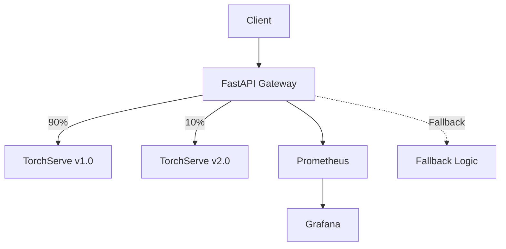

---
# the default layout is 'page'
icon: fas fa-home
order: 1
---

# 🛡️ Project Seraphim

Welcome to **Project Seraphim**, an AI reliability engineering platform that demonstrates how to run ML/LLM inference with production-grade guardrails.

## 🚀 Quick Start

```bash
# Clone the repository
git clone https://github.com/j0c2/project-seraphim.git
cd project-seraphim

# Start all services
docker-compose up -d

# Verify the platform is running
curl http://localhost:8000/health
```

## 🏗️ Architecture Overview



Project Seraphim provides:

- ✅ **SLO enforcement** for latency, availability, and error rates  
- 🔄 **Canary & rollback workflows** for safe model releases  
- 📈 **Drift detection** using embeddings and prediction distributions  
- 🔧 **Auto-scaling** on GPU/CPU usage and request throughput  
- 🧪 **Failure injection** and chaos experiments to validate resilience  

## 📊 Key Features

### Monitoring & Observability
- **Prometheus** metrics collection from gateway and TorchServe
- **Grafana** dashboards with real-time performance visualization
- **Custom metrics** for inference requests, latency, error rates, and canary routing
- **Alert rules** for proactive issue detection

### Operational Excellence
- **Health checks** and service monitoring
- **Automated backup** and disaster recovery procedures
- **Performance tuning** guidelines for production workloads
- **Incident response** workflows and escalation procedures

### Model Management
- **Canary deployments** with configurable traffic splitting
- **A/B testing** capabilities for model validation
- **Safe rollback** procedures for problematic deployments
- **Model lifecycle** management through TorchServe

## 🔗 External Links

- **[GitHub Repository](https://github.com/j0c2/project-seraphim)**
- **[Issues & Support](https://github.com/j0c2/project-seraphim/issues)**

---

**Project Seraphim** - *Guardians of AI Systems*

Built with ❤️ for production ML reliability
