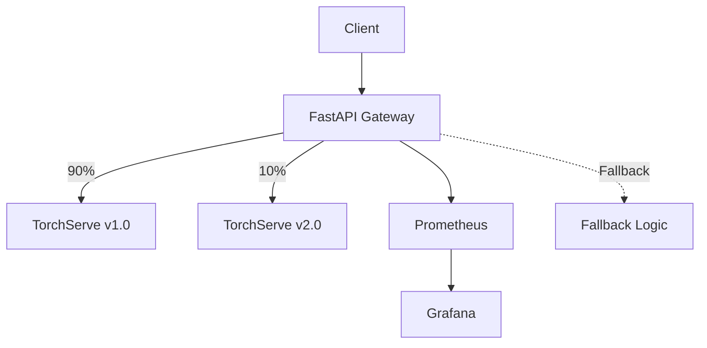

# 🛡️ Project Seraphim

Welcome to Project Seraphim, an AI reliability engineering platform that demonstrates how to run ML/LLM inference with production-grade guardrails.

## 🚀 Quick Start

```bash
# Clone the repository
git clone https://github.com/j0c2/project-seraphim.git
cd project-seraphim

# Start all services
docker-compose up -d

# Verify the platform is running
curl http://localhost:8000/health
```

## 🏗️ Architecture Overview



Project Seraphim provides:

- SLO enforcement for latency, availability, and error rates  
- Canary & rollback workflows for safe model releases  
- Drift detection using embeddings and prediction distributions  
- Auto-scaling on GPU/CPU usage and request throughput  
- Failure injection and chaos experiments to validate resilience  

<!--posts-->
<!--projects-->
<!--author-->
