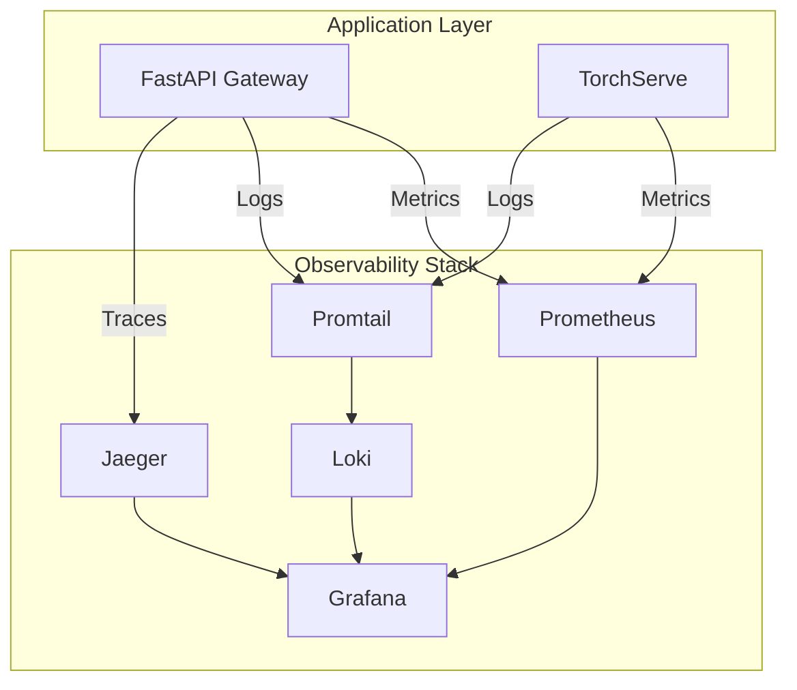

# 📊 Observability Guide

Project Seraphim implements comprehensive observability with **metrics**, **logs**, and **distributed tracing** to ensure reliable ML inference operations.

## Three Pillars Architecture



## 📈 Metrics Collection

### Gateway Metrics

The FastAPI inference gateway exposes Prometheus metrics at `/metrics`:

```python
# Request counters with labels
seraphim_inference_requests_total{variant="baseline",outcome="success"}

# Latency histograms
seraphim_inference_latency_seconds_bucket{variant="candidate",le="0.1"}
```

**Key Metrics:**
- `seraphim_inference_requests_total` - Counter by variant and outcome
- `seraphim_inference_latency_seconds` - Histogram by variant

### TorchServe Metrics

TorchServe built-in metrics on port 8082:
- `ts_inference_requests_total` - Total inference requests
- `ts_inference_latency_microseconds` - Inference latency
- `ts_queue_latency_microseconds` - Queue waiting time

## Local Endpoints and Ports

- Gateway (FastAPI)
  - http://localhost:8088/healthz, /readyz, /metrics, /predict
- TorchServe
  - Inference: http://localhost:9080
  - Management: http://localhost:9081
  - Metrics: http://localhost:9082/metrics
- Prometheus: http://localhost:9090
- Grafana: http://localhost:3000 (default admin/admin)

## Bring It Up Locally

```bash
# From repo root
docker compose up -d --build

# Check Prometheus targets
curl -s 'http://localhost:9090/api/v1/targets' | jq '.data.activeTargets | map({job: .labels.job, health: .health})'

# Generate traffic so metrics appear
for i in {1..100}; do \
  curl -s -X POST http://localhost:8088/predict -H 'Content-Type: application/json' -d '{"text": "load'$i'"}' >/dev/null; \
  sleep 0.05; \
done
```

Open Grafana at http://localhost:3000 and select the "Seraphim Inference Overview" dashboard.

## PromQL Cookbook

- RPS (1 minute rate)

```promql
sum(rate(seraphim_inference_requests_total[1m]))
```

- Error percentage over 5 minutes

```promql
(
  sum(rate(seraphim_inference_requests_total{outcome!="success"}[5m]))
  /
  sum(rate(seraphim_inference_requests_total[5m]))
) * 100
```

- p95 latency (milliseconds)

```promql
histogram_quantile(
  0.95,
  sum by (le) (rate(seraphim_inference_latency_seconds_bucket[5m]))
) * 1000
```

- Requests by variant (baseline vs candidate)

```promql
sum by (variant) (rate(seraphim_inference_requests_total[1m]))
```

- Requests by outcome (success, timeout, http_error, error)

```promql
sum by (outcome) (rate(seraphim_inference_requests_total[1m]))
```

- TorchServe RPS (if metrics are present)

```promql
sum(rate(ts_inference_requests_total[1m]))
```

## Dashboard Details

The dashboard at config/observe/grafana/dashboards/seraphim.json includes:

- RPS (1m) – total request rate
- Error % (5m) – rolling percentage of non-success outcomes
- Latency p95 (ms) – SLO-oriented high percentile
- Requests by Variant (1m) – canary split visibility
- Requests by Outcome (1m) – error mode visibility
- TorchServe Inference RPS (1m) – optional depending on TorchServe export

Panels use the PromQL queries listed above. You can customize the dashboard in Grafana or update the JSON.

## Troubleshooting

- "No data" in Grafana
  - Ensure you sent traffic to /predict; without traffic, only default Python/process metrics are present
  - Confirm Prometheus targets are "up": http://localhost:9090 -> Status -> Targets
- TorchServe metrics empty
  - The endpoint may respond 200 but not emit named series in some images/configs
  - Metric job health still shows up; rely on gateway metrics for most views
  - Ensure metrics are enabled: metrics_format=prometheus in TorchServe config
- Timeouts/HTTP errors
  - To simulate timeouts, reduce gateway TS_TIMEOUT_MS (e.g., 50) and send traffic
  - To simulate HTTP errors, stop TorchServe temporarily: `docker compose stop model-server`
- Grafana login
  - Default local credentials are admin/admin; change via env vars GF_SECURITY_ADMIN_USER/PASSWORD

## Kubernetes Notes

- Charts for gateway and TorchServe are at config/infra/helm
- For Prometheus/Grafana in-cluster, consider kube-prometheus-stack or your organization's stack
- Gateway env variables are configured via Helm values (see values.yaml)
- Multi-arch clusters: you can use nodeSelector to schedule TorchServe on amd64 nodes if needed

## Example Alerts (Prometheus rules file)

The local compose rules file is empty (config/observe/prometheus/rules.yml). Example alerts:

```yaml
# config/observe/prometheus/rules.yml
# An example of file-based rules (not the Operator CRD format)
groups:
  - name: seraphim.rules
    rules:
      - alert: HighErrorRate
        expr: (
          sum(rate(seraphim_inference_requests_total{outcome!="success"}[5m]))
          /
          sum(rate(seraphim_inference_requests_total[5m]))
        ) > 0.05
        for: 5m
        labels:
          severity: warning
        annotations:
          summary: "High error rate (>5%)"

      - alert: HighLatencyP95
        expr: histogram_quantile(0.95, sum by (le) (rate(seraphim_inference_latency_seconds_bucket[5m]))) > 0.5
        for: 10m
        labels:
          severity: warning
        annotations:
          summary: "High p95 latency (>500ms)"
```

## Security & Production Considerations

- Don't expose Prometheus and Grafana publicly without authentication
- Configure Grafana auth and SSL when deploying outside local dev
- Use scrape labels and relabeling if you add more services
- Consider remote_write to a centralized Prometheus/TSDB if needed

## Extending Metrics

- Gateway metrics can be extended with more labels (e.g., route, tenant)
- Add panels for p50, p99, per-variant latencies:
  - p50: histogram_quantile(0.50, …)
  - p99: histogram_quantile(0.99, …)
- Add TS model/version dimensions if TorchServe exposes them


## 📋 Structured Logging

### Log Format

All logs are structured JSON with correlation IDs:

```json
{
  "asctime": "2024-08-28T15:30:45Z",
  "name": "seraphim-inference", 
  "levelname": "INFO",
  "message": "Processing prediction request",
  "service_name": "seraphim-inference",
  "trace_id": "a1b2c3d4e5f6789012345678",
  "span_id": "1234567890abcdef",
  "correlation_id": "req-uuid-12345",
  "variant": "baseline",
  "model_name": "custom-text",
  "latency_ms": 45.2
}
```

### Log Levels

- **DEBUG** - Detailed diagnostic information
- **INFO** - General application flow  
- **WARNING** - Potential issues (timeouts, fallbacks)
- **ERROR** - Error conditions requiring attention
- **CRITICAL** - Serious errors requiring immediate action

## 🔍 Distributed Tracing

### Trace Structure

Each prediction request creates a trace with spans:

```
POST /predict [trace_id: abc123]
├── canary_routing [span_id: def456]
│   ├── variant selection
│   └── URL construction
└── model_inference [span_id: ghi789] 
    ├── HTTP request to TorchServe
    ├── Response parsing
    └── Error handling
```

### Correlation IDs

Correlation IDs link logs and traces:
- Generated per request or extracted from `X-Correlation-Id` header
- Propagated through all service calls
- Available in both logs and trace baggage

## 🔧 Debug Endpoints

### Observability Health
```bash
# Check observability stack health
curl http://localhost:8088/observability/health

# Get configuration
curl http://localhost:8088/observability/config

# Change log level dynamically
curl -X POST http://localhost:8088/observability/log-level -d "DEBUG"

# Get trace information
curl http://localhost:8088/observability/trace/{correlation-id}
```

## 🚀 Enhanced Setup

### 1. Start the Complete Stack
```bash
# Start all services including observability stack
docker-compose up -d

# Verify all services are running
docker-compose ps
```

### 2. Access All UIs
- **Grafana**: http://localhost:3000 (admin/admin)
- **Jaeger**: http://localhost:16686 (tracing UI)
- **Prometheus**: http://localhost:9090 (metrics & alerts)
- **Loki**: http://localhost:3100 (logs API)

### 3. Generate Comprehensive Test Data
```bash
# Generate traffic with correlation IDs for full observability
for i in {1..100}; do 
  curl -s -X POST http://localhost:8088/predict \
    -H "Content-Type: application/json" \
    -H "X-Correlation-Id: test-$i" \
    -d "{\"text\": \"test request $i\"}" >/dev/null
  sleep 0.1
done
```

## 🔍 Advanced Troubleshooting

### Cross-Stack Debug Workflow

```bash
# 1. Make request with correlation ID
curl -X POST http://localhost:8088/predict \
  -H "Content-Type: application/json" \
  -H "X-Correlation-Id: debug-123" \
  -d '{"text": "debug test"}'

# 2. Check metrics in Prometheus
# 3. Search logs by correlation ID in Loki
# 4. Find trace by correlation ID in Jaeger
# 5. Correlate findings across all three pillars
```

### LogQL Examples

```logql
# All inference service logs
{service="seraphim-inference"}

# Error logs only
{service="seraphim-inference", level="ERROR"}

# Logs with specific correlation ID
{service="seraphim-inference"} | json | correlation_id="debug-123"

# High latency requests
{service="seraphim-inference"} | json | latency_ms > 100
```

## 📊 Enhanced Dashboards

The new **Observability Overview** dashboard includes:

**Service Level Indicators**
- Request rate, error rate, P95 latency
- Active traces, log error rate  
- Canary traffic percentage

**Distributed Tracing**
- Recent traces with filtering
- Error trace highlighting
- Service dependency graphs

**Application Logs**
- Real-time log streaming
- Error log panels
- Log volume analytics

**Correlation Analysis**
- Trace-to-logs linking
- Request journey visualization

## 📚 Best Practices

### Observability Strategy
- **Monitor the Golden Signals**: latency, traffic, errors, saturation
- **Use correlation IDs** consistently across services
- **Set up SLO-based alerting** rather than threshold-based
- **Create runbooks** for common alert scenarios
- **Practice incident response** with observability tools

### Performance Optimization
- **Sampling** traces in high-volume environments
- **Log level management** to control verbosity
- **Retention policies** for logs and metrics
- **Dashboard performance** tuning for large datasets

## 🔗 Complete Service Endpoints

| Service | Endpoint | Purpose |
|---------|----------|----------|
| **Grafana** | http://localhost:3000 | Dashboards and visualization |
| **Jaeger** | http://localhost:16686 | Distributed tracing UI |
| **Prometheus** | http://localhost:9090 | Metrics and alerting |
| **Loki** | http://localhost:3100 | Log aggregation API |
| **Gateway** | http://localhost:8088/metrics | Prometheus metrics |
| **Gateway** | http://localhost:8088/observability/* | Debug endpoints |
| **TorchServe** | http://localhost:9082/metrics | Model server metrics |

---

For questions or enhancements, see the code under `services/shared/observability.py` and the configuration files in `config/observe/`.
